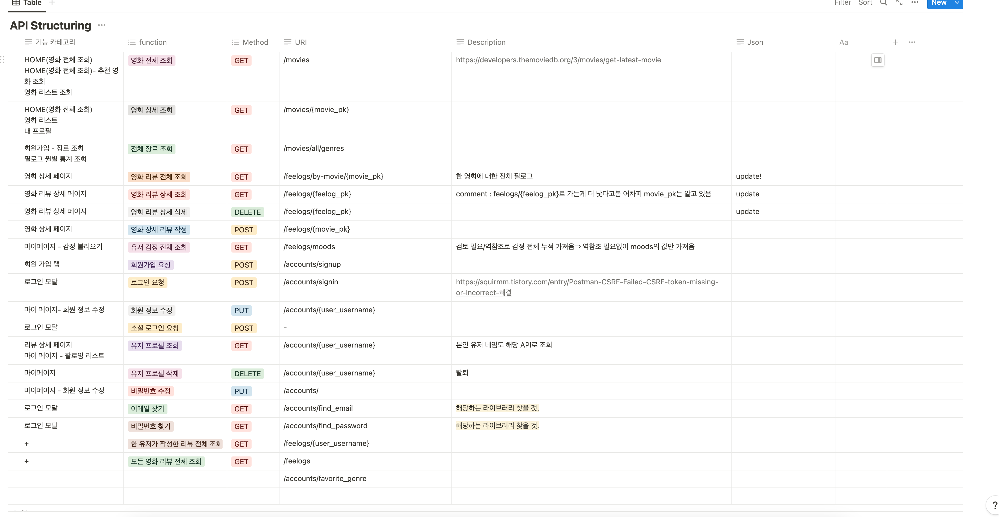
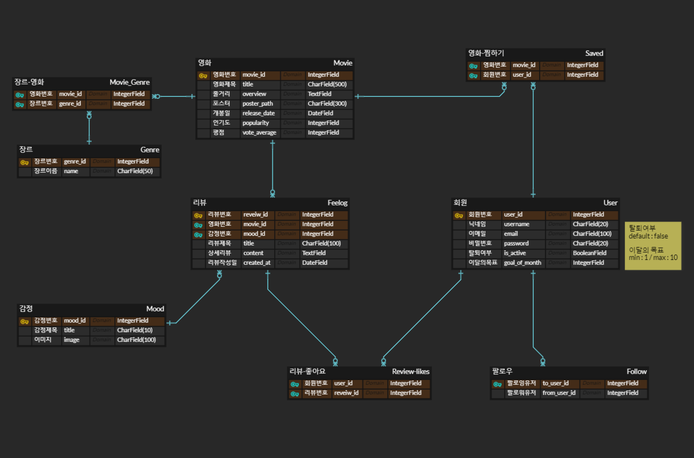

# [Project] Feel:em

## [Notion]
https://www.notion.so/Project-Feel-em-1e20a457fbdf4151bfac0cb4354742c2?pvs=4
## 🐵개요
| 개요 타이틀 | 내용 |
| --- | --- |
| 프로젝트 명 | 영화 감상평 기록을 위한 웹 서비스 Feel:em |
| 개발 인원 | 2명 |
| 개발 기간  | 5월 17일 - 5월 26일 |
| 주요 기능  | 1. 회원 가입 기능 - SNS 연동 로그인, 일반 로그인   2. 영화 기록 게시판 - CRUD 기능   3. 프로필 페이지 - CRUD 기능   4. 프로필 Follow/Unfollow 기능   5. 썸네일 메이커 - 이미지 추출 기능  |
| 개발 언어 | JavaScript ES6 / Python3 / CSS / HTML / Django 3.2.18 / Vue2.7 / node.js 18.16.0 /  |
| 배포 환경 | -  |
| DB | SQLite SDN 3 |

## 🥇성과 
- 삼성 청년 SW 아카데미 9기 관통 프로젝트 최우수상 수상

## 🐵업무 분담
신지원 : 
- [Backend] 전반적인 Django 백엔드 서버 구성
- TMDB API를 통한 DB 데이터 추출과 저장
- Front-end 파트에서 MyPage 화면 구성 담당
- DB Serializer 설계
- Django 및 DB 에러 수정
- 프로젝트 발표 담당

## 🙊주제선정 
1. **누구를 위한 서비스?**
    - 자신의 `영화 취향`을 기록하고 싶은 20-30대 고객을 타겟으로 한 `영화 아카이빙 사이트`
2. **사이트 개요**
- **나의 영화 취향을 느껴보세요! → feel them! →** `Feel:em`
    - 영화 검색/영화에 대한 `Feel-log` 작성을 통해 개인의 영화 취향을 한 눈에 볼 수 있다.
- **영화 취향을 알고 싶은 유저**  : `Feelmer`
    - `Feelmer` 들은 자신들이 선호한다고 생각하는 장르 3-5개를 회원가입 시 설정한다.
    - `Feelmer` 의 취향에 맞는 색상을 설정해 프로필 페이지를 꾸밀 수 있다.
    - `Feelmer` 들의 취향 탐색을 위한 월 별 목표를 세울 수 있다.
- `Feelmer` **들의 영화 기록 :** `Feel-log`
    - `Feel-log` 에서는 한 줄 기록, 상세 기록, 명대사(선택),썸네일 메이커 기능을 사용할 수 있다.
    - 한 줄 기록 : 영화 요약 평을 작성할 수 있으며, `Feel-log` 리스트에 노출되는 페이지 
    (100자)
    - 상세 기록 : 나의 영화 감상을 상세하게 작성할 수 있다. 글자 수 제한(500자)
    - 명대사 : 네이버 영화 API를 통해 불러온 명대사를 선택하여 넣을 수 있다.
    - 썸네일 메이커 : SNS에 업로드할 수 있도록 영화 포스터, 명장면, 한 줄기록 등이 작성된 이미지를 export 할 수 있다.
- **다른** `Feelmer` **는 어떻게 생각했을까? →  프로필과 리뷰 탐색**
    - `Feelmer` 프로필을 구독하거나 영화 상세 페이지에서 다양한 `Feelmer` 의 리뷰를 감상할 수 있다.
    - 선호하는 리뷰는 좋아요를 누를 수 있고, 해당 리뷰를 작성한 `Feelmer` 를 Follow할 수 있다.

##🙉Trouble Shooting

##🙈API 설계

##🙉 Wireframe

## DB 설계

## 추천기능 구현
- 사용자가 선호하는 장르를 최대 5개까지 받아 장르를 바탕으로 데이터를 추출하고 15개 내외로 보여준다.  

## 🎬개발일지

## 배운 점 / 느낀 점

### 🌲신지원🌲

### 1. 기획과 계획의 중요성

저로서는 처음 해보는 프로젝트였기 때문에, 파트너와 중간에 길을 잃지 않기 위해서 기획 단계에 많은 시간과 노력을 투자했습니다. 프로젝트 진행 중 DB에서 어떤 API를 전달해야 할 지, view에서 몇 번의 Depth로 페이지를 구성해야 할지 등 모든 결정들은 탄탄한 계획 덕분에 길을 잃지 않고 진행할 수 있었습니다. 

### 2. 평소 학습의 중요성

평소 수업 시간에 배웠던 내용을 기반으로 웹 사이트를 제작했지만 실제로 코드를 작성하는 과정에서 헷갈리는 부분이나 다시 배워야 하는 개념이 많았습니다. 덕분에 프로젝트 기간 동안 많은 고생을 했지만, 이론적으로만 배웠던 내용이나 간단한 실습으로 끝냈던 교육 내용을 심화적으로 익힐 수 있어서 큰 도움이 되었습니다. 프로젝트를 통해 평소에 학습하는 것의 중요성을 다시 한 번 깨달을 수 있었습니다.

### 3. 협업과 소통의 중요성

혼자 진행하는 프로젝트가 아니기에, 파트너와의 협업이 매우 중요한 시간이었습니다. 프로젝트 기간 동안 매일 각자의 역할을 정의하고 필요한 내용을 논의하는 시간을 가졌습니다. 제한된 시간을 최대한 효율적으로 활용하기 위해 꾸준한 소통과 데일리 체크리스트를  작성한 것이 많은 도움이되었습니다. 파트너와 계획을 꼼꼼히 세우고, 서로의 아이디어를 존중하고 피드백을 주고받는 과정 덕분에 프로젝트가 훨씬 수월했다고 생각합니다. 좋은 파트너 덕분에 첫 프로젝트를 성공적으로 끝낼 수 있었다고 생각합니다. 

### 4. 문제 해결 능력의 발전

짧은 기간 동안 원인을 알 수 없는 수많은 문제와 어려움을 마주하게 되었습니다. 하지만 이러한 문제들을 해결하기 위해 협업하고, 검색을 통해 해결 방안을 찾아 나가는 과정에서 스스로 꾸준히 발전함을 알 수 있었습니다. 이번 경험을 토대로 2학기에도 다양한 문제를 만났을 때 빠르게대응하는 방법을 찾고, 필요한 정보를 탐색하여 문제를 해결할 수 있을 것이라고 생각합니다. 

